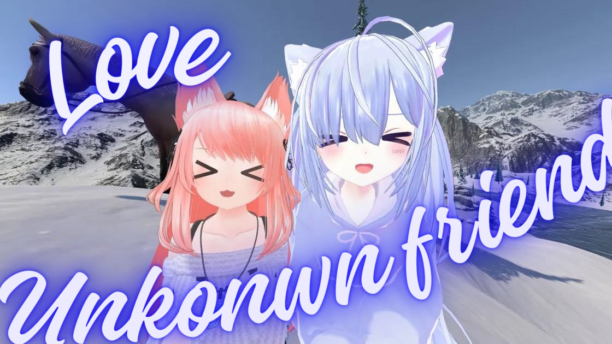

# Greetings👋

I’m nash, a Japanese student interested in various areas.

<!---
削除されたカウンタ
 
--->

## About Me

- 🏫 I’m currently a student of informatics at NITSC.
- 🌱 Following my own curiosity, acquiring knowledge.
- 😄 Pronouns: Anything is ok.
- <!--- FUN_FACT_START --->⚡ Fun fact: It seems a year has passed since I started programming! <!--- FUN_FACT_END --->
- 🎮 VRChat is my favorite game! Send nashdev255 a friend request then let's hung out with me!
- ❓ About more: Ask [Twitter @nashdev255](https://twitter.com/nashdev255).

<!--- Fun fact : counting since 2022/04/07... --->

## Works

### Games

- Honey RPG
- イトキヨクエスト

### Other Applications

- Honey OS
- StudySyncHub

### Tools

\* In order to check restricted contents like R-18 contents, follow the link below.

## Languages

- C/C++
- Java/Kotlin
- C#
- Rust
- Go
- HTML&CSS
- JavaScript/TypeScript

## Status

